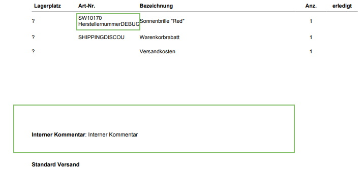

# LocherInvoiceUpgrade

  
LocherInvoiceUpgrade is a plugin that adds ...  
* **supplierNumber** for each orderPosition
* **internal comment**  

for a specific document type (it checks via **$Document.name**)

*Developed for shopware 5*
